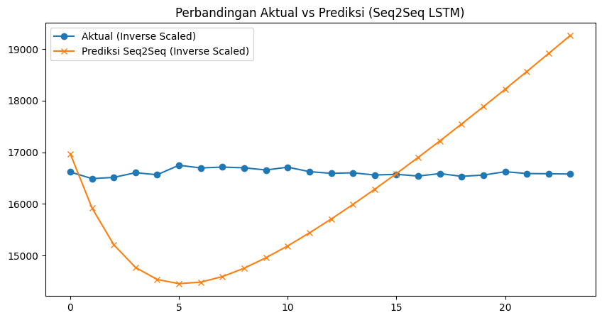
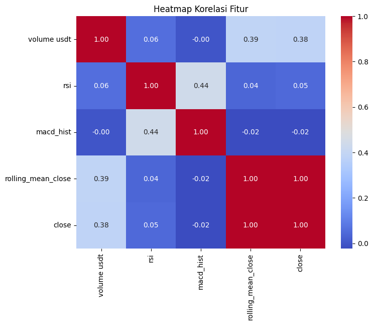

# LSTM Time-Series Forecasting

Multi-step **time-series forecasting** on financial market data (USDT price with RSI, MACD, and volume features), comparing a **baseline LSTM** against a **sequence-to-sequence LSTM**.

  

## Overview

- **Framing:** the series is turned into supervised windows (`window_size` → `horizon`) for multi-step prediction.
- **Models:** a single-layer baseline LSTM and a seq2seq (encoder–decoder) LSTM, both trained and then compared against the actual values on a held-out test window.
- **Features:** engineered technical indicators — closing price, rolling mean, RSI, MACD histogram, and USDT volume.

  

## Tech stack

Python · TensorFlow / Keras · LSTM · pandas · NumPy · Matplotlib

## Notes

Deep-learning submission for Dicoding. Trained models are saved as `.keras` files in the project folder.
